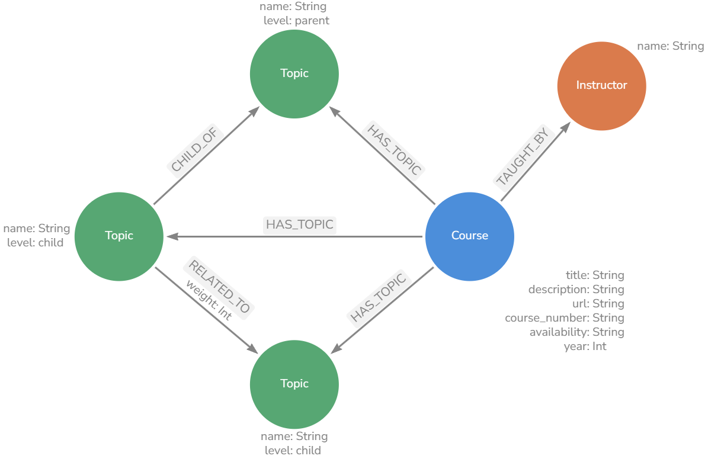
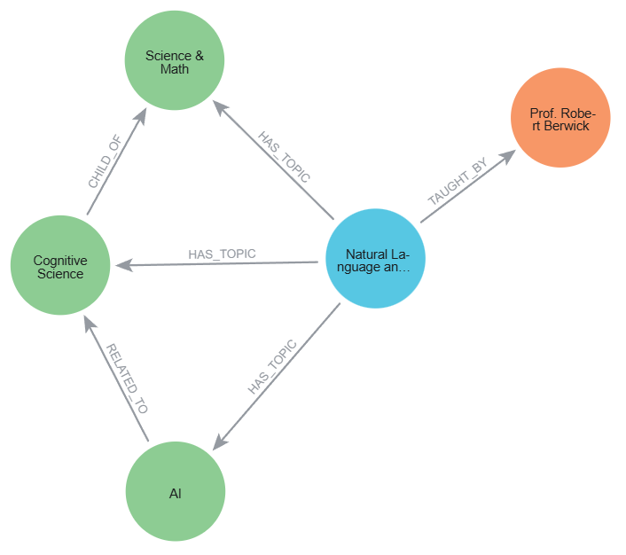
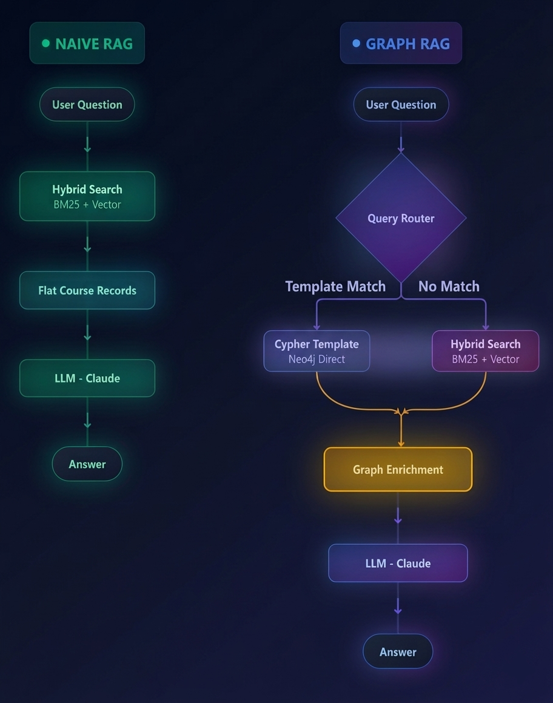
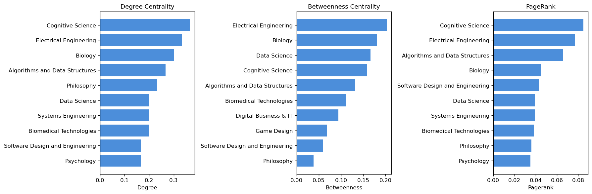
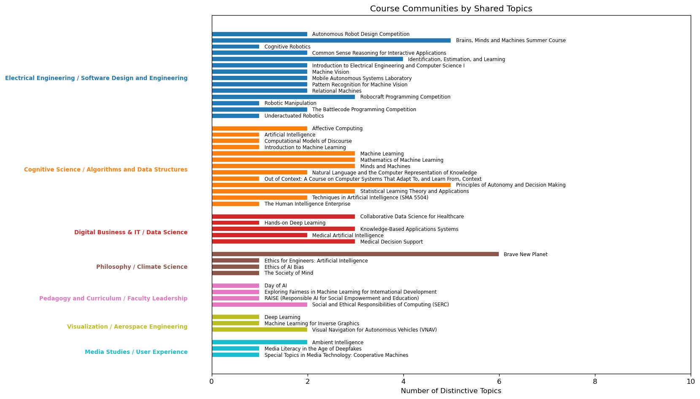

[](https://github.com/MathRC/graph-rag)
[](https://github.com/MathRC/graph-rag/blob/main/LICENSE.txt)
[](./notebooks)

# Designing an Ontology-Based Semantic Layer for Graph RAG

When LLMs are used, RAG and knowledge graphs are often suggested as ways to reduce hallucinations and obtain more precise answers. However, it is not always clear when they actually help. 

This project compares two RAG pipelines built on 50 MIT OpenCourseWare courses: a standard RAG pipeline and a Graph RAG pipeline that queries a Neo4j knowledge graph. The goal was to answer the question:

_Does adding a knowledge graph actually improve LLM retrieval?_

Both pipelines use the same dataset, embeddings, hybrid retrieval (BM25 + vector search), and LLM. The only difference is how the context is retrieved:

- **Naive RAG:** retrieves flat course records from hybrid search
- **Graph RAG:** queries a Neo4j knowledge graph using Cypher templates and graph traversal

The project also analyzes the graph itself using centrality, similarity, and community detection to reveal additional insights.

## Notebooks

| Notebook | What it does |
|---|---|
| [01 Project Overview](notebooks/01_project_overview.ipynb) | Goals, use cases, and data exploration |
| [02 Ontology Design](notebooks/02_ontology_design.ipynb) | From a taxonomy to a graph ontology |
| [03 Building the Graph](notebooks/03_build_graph.ipynb) | Data loading into Neo4j and graph structure validation |
| [04 RAG Comparison](notebooks/04_rag_comparison.ipynb) | Naive RAG vs Graph RAG: results and comparison |
| [05 Graph Analytics](notebooks/05_graph_analytics.ipynb) | Centrality metrics, Jaccard similarity, and Louvain community detection |

## The Dataset

The experiment uses a curated dataset containing information about **50 courses from [MIT OpenCourseWare](https://ocw.mit.edu/)**, parsed from MIT Learn course pages into a structured CSV.

Each course has a title, description, URL, course number, topics, instructors, availability, and year. 

With this structure, it is possible to develop a knowledge graph to answer practical questions, such as:

* What are the most recent courses on a specific topic?
* Which other courses are taught by the same instructor?
* What topics frequently appear together in the curriculum?


_Note: The dataset was curated specifically for this project. It is not affiliated with or endorsed by MIT._

### Graph schema

To represent the dataset as a knowledge graph, I designed an ontology defining the main entities (courses, instructors, and topics) and their relationships, including a two-level topic hierarchy and topic co-occurrence links.

<p align="center">
  
</p>

### Sample subgraph

The image below illustrates a course node connected to its topics, instructor, and the relationships between them:

<p align="center">
  
</p>

The knowledge graph contains 50 courses, 70 instructors, and 44 topics (organized in a two-level hierarchy), connected by 669 relationships (HAS_TOPIC, TAUGHT_BY, CHILD_OF, and RELATED_TO).

## How the pipelines work

<p align="center">
  
</p>

**Naive RAG** retrieves courses by hybrid search (BM25 + vector with reciprocal rank fusion), then passes flat text records to Claude.

**Graph RAG** routes each question to a Cypher template when possible (instructor lookup, topic filtering, shared instructor, etc.), querying Neo4j directly. When no template matches, it falls back to hybrid search. In both cases, it enriches the results with graph context (topic hierarchy, co-occurring topics, and neighboring courses) before sending them to the LLM.

## Results

To evaluate these pipelines, I built a **ground truth** set (golden set). The evaluation then measured **retrieval recall**: how many of the expected answers each pipeline retrieved.

For example, if the ground truth lists 5 relevant courses and the pipeline retrieves 2, recall is 2/5 (40%). These were the results:

| # | Question type | Naive RAG | Graph RAG |
|---|---|---|---|
| 1 | Instructor lookup | 1/2 (50%) | 2/2 (100%) |
| 2 | Recent courses by topic | 2/5 (40%) | 5/5 (100%) |
| 3 | Shared instructor | 0/3 (0%) | 3/3 (100%) |
| 4 | Topic co-occurrence | 4/7 (57%) | 7/7 (100%) |
| 5 | Related courses | 1/10 (10%) | 10/10 (100%) |
| 6 | Broad semantic query | 3/12 (25%) | 3/12 (25%) |

On five queries involving relationships between courses, topics, or instructors (Questions 1 to 5), Graph RAG achieved **100% retrieval recall**, while Naive RAG scored between 0% and 57%.

Graph structure improves retrieval when questions require relationships, filtering, or aggregation across the dataset.
When the question depends purely on semantic understanding of course descriptions, like Question 6, both pipelines perform similarly.


## Graph analytics highlights

In addition to the RAG comparison, graph analytics reveal structural patterns in the curriculum that are difficult to detect through flat text search.

### Topic centrality

Which topics hold the curriculum together? Three centrality metrics (degree, betweenness, and PageRank) identify the bridging topics:



* **Degree centrality:** _Cognitive Science_ and _Electrical Engineering_ have the highest number of connections to other topics. This means they co-occur with many other topics and are near the center of the curriculum’s topic network.

* **Betweenness centrality:** _Electrical Engineering_ and _Biology_ frequently lie on the shortest paths between other topics. That is, they act as bridges connecting otherwise separate areas of the curriculum.

* **PageRank:** _Cognitive Science_ and _Electrical Engineering_ rank highest. This indicates that they are not just well connected, but connected to other important topics, making them structurally influential in the topic network.

* **Notable insight:** Even though _Biology_ appears in only 2 courses, it has one of the highest betweenness scores. This means that it connects topic clusters that would otherwise remain disconnected.


### Course communities

Louvain community detection identified 7 clusters of related courses:



These clusters group courses that share topics and can be used to identify coherent areas of study, support course recommendations, and help learners navigate related subjects.

## Tech stack

- **Python:** pandas, numpy, matplotlib
- **Graph database:** Neo4j + Cypher
- **LLM:** Claude Sonnet 4 via Anthropic API
- **Embeddings:** BAAI/bge-small-en-v1.5 via sentence-transformers
- **Search:** BM25 (rank_bm25) + Vector (cosine similarity) + Reciprocal Rank Fusion
- **Graph analytics:** NetworkX + Louvain (python-louvain)


## Project structure

```
graph-rag/
├── data/
│   └── curated/
│       ├── courses.csv
│       ├── topic_hierarchy.csv
│       ├── ground_truth.json
│       └── rag_comparison_results.json
├── notebooks/
│   ├── 01_project_overview.ipynb
│   ├── 02_ontology_design.ipynb
│   ├── 03_build_graph.ipynb
│   ├── 04_rag_comparison.ipynb
│   └── 05_graph_analytics.ipynb
├── schema/
│   ├── courses-schema.gql
│   ├── courses-schema.png
│   ├── sample-subgraph.png
│   └── taxonomy_tree.png
├── figures/
│   ├── pipeline_comparison.png
│   ├── query_plan_instructor_lookup.png
│   ├── topic_centrality.png
│   ├── similarity_distribution.png
│   └── course_communities.png
├── .env.example
├── requirements.txt
├── LICENSE.txt
└── README.md
```

## Setup

### Prerequisites

- Python 3.11+
- Neo4j Desktop (or a running Neo4j instance)
- An Anthropic API key

### Installation

```bash
git clone https://github.com/MathRC/graph-rag.git
cd graph-rag
pip install -r requirements.txt
```

### Environment variables

Create a `.env` file in the project root using `.env.example` as a template and add your Neo4j and Anthropic credentials.

### Running the notebooks

Run the notebooks in order (01 through 05). Notebook 03 builds the graph in Neo4j, so Neo4j must be running. Notebook 04 calls the Anthropic API, so an API key is required.


## Author

**Matheus R. Chaud**  
Knowledge Engineer & Senior Translator  
NLP • AI • Python | Neo4j Certified Professional | M.A. in Linguistics

- [GitHub](https://github.com/MathRC)
- [LinkedIn](https://www.linkedin.com/in/matheus-chaud/)

## What's next

In my next project, I will rebuild this knowledge graph using RDF, OWL, and SPARQL and compare it with the property graph approach used here. What are the strengths and limitations of each paradigm? We'll find out in practice.